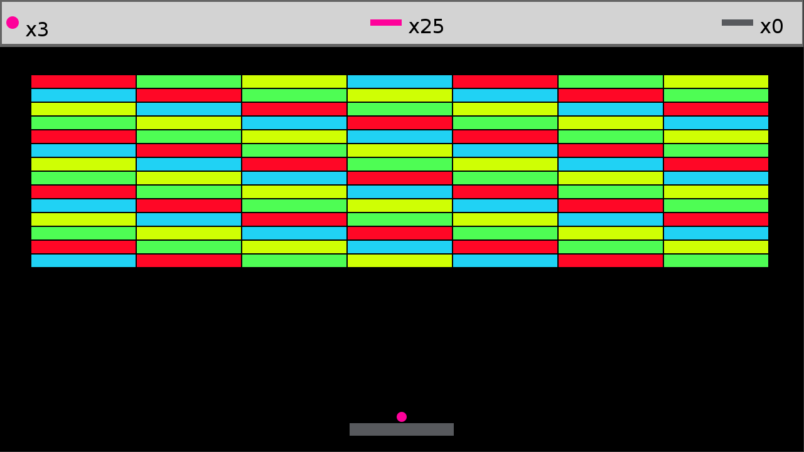
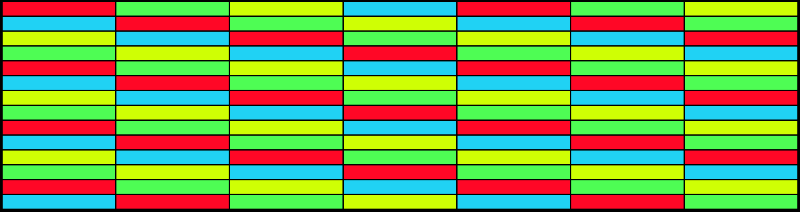
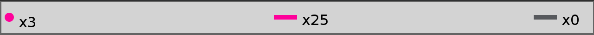
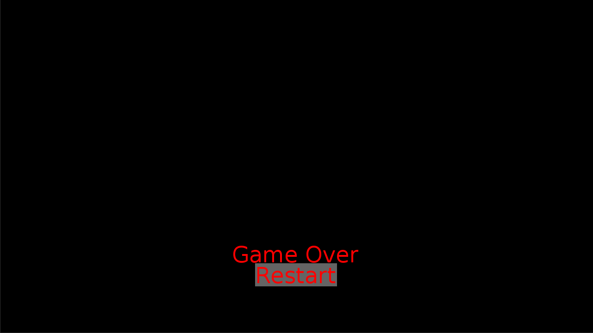
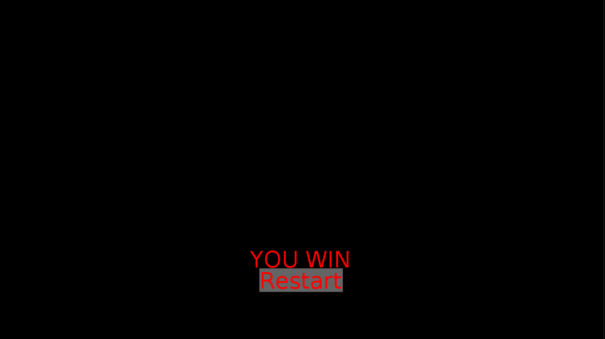
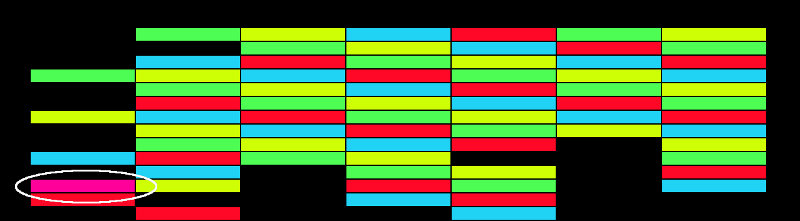

# Studienleistung III: GraphicsApp | Breakout

## Wichtige Informationen zur Bearbeitung der Aufgabe
- [Informationen zur Entwicklungsumgebung *IntelliJ IDEA*](https://elearning.uni-regensburg.de/mod/book/view.php?id=1480675)
- [Informationen zum Im- und Export von Projekten](https://elearning.uni-regensburg.de/mod/book/view.php?id=1480675&chapterid=51551)

## Starterpaket

Ein vorbereitetes Starterpaket zur selbständigen Implementierung der Aufgabe finden Sie [hier](https://github.com/OOP-Wintersemester-2021/Studienleistung-III-Breakout/archive/refs/heads/starter.zip).

## Allgemeine Hinweise zur Studienleistung
In dieser Studienleistung werden Sie eine Programmieraufgabe lösen.
Diese Programmieraufgaben besteht aus einem Projekt
* ```Studienleistung-III-Breakout```

Nutzen Sie zum Lösen der Aufgabe die bereitgestellte Klassendatei als Einstiegspunkt und fügen Sie weitere Klassen nach Bedarf hinzu.
Zum Einreichen Ihrer Aufgabe nutzen Sie die entsprechende Funktion in GRIPS.
Falls Sie Problemen mit dem Starterpaket oder dem Einreichen der Aufgabe haben, können Sie sich in den Handouts auf GRIPS informieren.

Achtung: Eine Verlängerung der Abgabefrist ist nicht möglich.
Einreichungen, die uns (zu spät) per E-Mail erreichen, werden nicht mehr berücksichtigt.
Alle nicht eingereichten Aufgaben werden mit nicht bestanden bewertet.
Testen Sie den Upload am besten schon vor Ablauf der Frist in Ruhe: Sie können bis zum Abgabetermin beliebig viele neue Lösungen einreichen.

Bewertungskriterien: Für die gesamte Studienleistung gilt, dass die eingereichten Lösungen nur die in der Aufgabenstellung beschriebenen Probleme lösen sollen.
Lassen Sie keinen Teil der jeweiligen Aufgabe weg und interpretieren Sie die Fragestellung nicht selbstständig.
Bewertet wird, in wie weit Sie das beschriebene Problem vollständig lösen.
Wenn Sie die Aufgaben erfolgreich bearbeitet haben, können Sie Ihre Lösung gerne kreativ gestalten und erweitern; achten Sie dabei darauf, dass die eigentlichen Anforderungen weiterhin erfüllt bleiben.
Die Qualität Ihres Codes fließt in die Gesamtnote mit ein: Nutzen Sie Decomposition um Ihre Programme übersichtlich zu gestalten.
Verwenden Sie sinnvolle Bezeichner für Variablen und Methoden und kommentieren Sie ausreichend.
Beachten Sie dazu die Kriterien für guten und schlechten Code, die in der Vorlesung erwähnt wurden.

Sollten Sie Fragen haben oder Hilfe brauchen, können Sie im Discord unter der Kategorie Support in den Channel Studienleistung uns eine Nachricht hinterlassen.
Wir stehen Ihnen dann zeitnah zur Seite über eine Direktnachricht.

# Breakout

## Ausgangslage
Im Rahmen dieser Aufgabe implementieren Sie das bekannte Spiel *Breakout* nach.



Die Ausgangsbedingung für diese Aufgabe ist wie folgt:

Sie implementieren ausgehend von einer leeren *GraphicsApp* das Spiel *Breakout*.

## Anforderungen

Folgende Anforderungen muss Ihre Implementierung von Breakout erfüllen:
* Blöcke
  * Es müssen mindestens **7** Spalten und **14** Reihen an Blöcken angeordnet werden
  * Die Blöcke müssen im *Treppenmuster* anhand der Abbildung unten gefärbt sein:
    * Neon Rot -> RGB: 255, 7, 38
    * Neon Grün -> RGB: 78, 253, 84
    * Neon Gelb -> RGB: 207, 255, 4
    * Neon Blau -> RGB: 32, 210, 244
  
    
    
    * Blöcke verschwinden, sobald die Kugel mit Ihnen kollidiert
    * Die Kugel wird bei Kollision korrekt abgelenkt
* Kugel
  * Die Darstellung der Kugel ist ein Objekt der Klasse ```de.ur.mi.oop.graphics.Circle```
  * Die Kugel muss gefärbt sein, z.B. Neon Pink -> RGB: 254, 1, 154
  * Die Kollisionsabfrage ist mit der Kugel als Kreis durchzuführen
  * Es wird einer der beiden mitgelieferten Sounds unter ```data/assets``` abgespielt, sobald die Kugel mit einem Block, dem Paddel oder dem Rand kollidiert
* Paddel
  * Das Paddel muss sich horizontal bewegen lassen: Taste A für eine Linksbewegung und Taste D für eine Rechtsbewegung
  * Das Paddel soll gefärbt sein, z.B. grau -> RGB: 87, 89, 93
  * Das Paddel muss mit der Kugel kollidieren können
* Statusanzeigen

  
  
    * drei Statusanzeigen müssen in Ihrem Breakout-Spiel vorhanden sein
    * auf der linken Seite befindet sich die Anzeige für die Anzahl der verfügbaren Kugeln, inklusive der Kugel, die bereits im Spiel ist
    * in der Mitte befindet sich die Anzeige für die Anzahl der noch abzuräumenden Blöcke bis ein Extraballblock erscheint
    * auf der rechten Seite befindet sich die Anzeige für die Anzahl der bisher insgesamt abgeräumten Blöcke
* Spielende
  * Sind keine Kugeln mehr verfügbar, endet das Spiel mit einem Game Over Screen

    

  * Räumen SpielerInnen alle Blöcke vom Spielfeld, dann endet das Spiel mit einem Game Over Screen

    
  
  * in beiden Fällen führt ein Klick auf Restart zum Neubeginn des Spiels
* Allgemein
    * Die Klasse ```BreakoutApp``` muss als Einstiegpunkt für Ihr Breakout-Spiel verwendet werden
    * Bei Start des Spiels sind *x* Kugeln verfügbar (im Beispiel hier sind drei Kugeln verfügbar).
        * Jedes Mal, wenn eine Kugel unten aus dem Spielfeld rausfällt verlieren Spielende diese Kugel
        * Beim Abräumen von hinreichend vielen Blöcken (z.B. 25 bei 14x7 Blöcken) wird beim Erreichen der Combo ein neuer Block erstellt
            * der Block erscheint an einer zufällig gewählten Stelle von bereits abgeräumten Blöcke
            * der Block fügt dem aktuellen Kugelkonto eine weitere Kugel hinzu, sobald dieser abgeräumt wird
            * der Block hat eine distinkte Farbe (z.B. die gleiche Farbe, wie die Kugel, da der Block eine Extrakugel beschert)

          

            * Fällt eine Kugel unten aus dem Spielfeld und bricht damit die aktuelle Combo, wird der Zähler der Combo wieder auf den Ursprungswert zurückgesetzt
            * Fällt eine Kugel unten aus dem Spielfeld, nachdem ein Extraballblock erstellt wurde, bleibt dieser Extraballblock erhalten, sofern kein Game Over erreicht wurde

    * Teilen Sie Ihre Anwendung in sinnvolle Komponenten ein und legen Sie entsprechende
      Klassen dafür an
    * Trennen Sie die Daten von Objekten von deren Darstellung
    * Verwenden Sie sinnvolle Datenstrukturen (z.B. ```ArrayList```)
    * Praktizieren Sie ```Decomposition```

## Hinweise
* Integration von Sound, Maus und Keyboard
  * Verwenden Sie die Klasse AudioClip, um Sounds in ihr Spiel zu integrieren
  * Überschreiben Sie die Methoden (@Override):
    * public void onMousePressed(MousePressedEvent event);, um Klickevents der
    linken Maustaste abzufangen
    * public void onKeyPressed(KeyPressedEvent event);, um die Eingabe durch die
    Tastatur abzufangen und das Paddel in die entsprechende Richtung zu bewegen
* Kollisionsabfragen
  * Objekte der Klasse GrahpicsObject, z.B. Image, Rectangle oder Circle erben von
  GraphicsObject, haben die Methode public boolean hitTest(float x, float y);
  * Benutzen Sie diese Methode, um Kollisionsabfragen der einzelnen Spielobjekte zu
  implementieren

## Ideen für Erweiterungen
```Wenn Sie die Aufgaben erfolgreich bearbeitet haben, können Sie Ihre Lösung gerne kreativ gestalten und erweitern; achten Sie dabei darauf, dass die eigentlichen Anforderungen weiterhin erfüllt bleiben.```

* Erweiterungen sind komplett optional:
* Ideen für Erweiterungen:
  * weitere Soundeffekte
  * Hintergrundmusik
  * Mehr Bonusblöcke
    * Multiball (z.B. drei Kugeln gleichzeitig)
    * Multipaddel (z.B. zwei Paddel nebeneinander)
    * etc.
  * Verschiedene Blocktypen
    * Blöcke haben *hit points* und müssen entsprechend oft getroffen werden
    * Blöcke können nur mit einer bestimmten Art von Kugel abgeräumt werden
    * etc.
  * Verschiedene Kugeltypen
    * Heavyball - größere Kugel
    * Busterball - bei Kollision mit Paddel wird Kugel modifiziert und räumt alles ab, was sie berührt und wird nicht vom rand des Spielfeldes abgelenkt
    * Explosionball - bei Kollision explodiert die Kugel und innerhalb eines bestimmten Radius werden weitere Blöcke abgeräumt; die Kugel ist danach verloren
    * etc.
  * Animationen
    * zerbröckelnde Blöcke
    * etc.
  * etc.